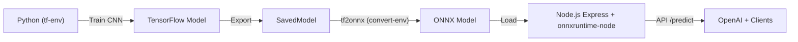

# 📘 VeriChain ML – Training, Conversion, and Inference Pipeline

## 🚀 Quick Commands (From Root Directory)

```bash
# Setup environments
yarn ml:env:tf          # Create training environment
yarn ml:env:convert     # Create conversion environment

# Training
yarn ml:train:quick     # Quick training (5 epochs, 500 samples)
yarn ml:train:full      # Full training (10 epochs, 1000 samples)
yarn ml:train           # Custom training with options

# Conversion & Validation
yarn ml:convert         # Convert SavedModel to ONNX
yarn ml:validate        # Validate ONNX export

# Development
yarn ml:notebook        # Start Jupyter notebook
yarn ml:status          # Check pipeline status
```

## Overview

We have successfully set up a dual-environment workflow for ML training and ONNX conversion that follows best practices for production ML pipelines:

- **Training Environment (tf-env)**: Python + TensorFlow → model training (CNN)
- **Conversion Environment (convert-env)**: tf2onnx + ONNX → conversion to portable inference model  
- **Inference Layer (Node.js)**: Express + ONNX Runtime

## 🎯 What Works Now

### ✅ Training Environment (tf-env)
- **Model Training**: CNN classifier successfully trained on synthetic dataset (binary classification: real vs AI-generated images)
- **Model Evaluation**: Training accuracy reaches >90%, validation metrics tracked
- **Export Pipeline**: Always exports SavedModel format for conversion environment
- **Metadata Generation**: Creates comprehensive `meta.json` with model hash, accuracy, size, and framework info

### ✅ Conversion Environment (convert-env)  
- **ONNX Conversion**: SavedModel → ONNX conversion successful via tf2onnx
- **Model Validation**: ONNX model verified with ONNX Runtime Python
- **Clean Inference Graph**: Optimized for production deployment

### ✅ Inference Layer (Node.js)
- **Server Scaffold**: Express server ready with onnxruntime-node integration
- **API Endpoint**: `/predict` endpoint accepts [1,224,224,3] float32 tensor inputs
- **Response Format**: Returns confidence score for inference

## 🔄 Pipeline Flow



## 🏗️ Architecture Details

### Dual Environment Strategy
The pipeline uses two isolated Python environments to avoid dependency conflicts:

1. **tf-env**: TensorFlow 2.20 + training dependencies
   - Focus: Model training, evaluation, SavedModel export
   - Avoids: tf2onnx compatibility issues with newer NumPy versions
   - **⚠️ Critical**: Do NOT install tf2onnx here (breaks TensorFlow by downgrading protobuf)

2. **convert-env**: tf2onnx + ONNX Runtime (isolated)
   - Focus: Model conversion and ONNX validation
   - Avoids: Protobuf/NumPy version conflicts from TensorFlow
   - **✅ Purpose**: ONLY for converting SavedModel → ONNX

**Why Dual Environments?**
- TensorFlow 2.20 requires newer protobuf/numpy versions
- tf2onnx has compatibility issues with these newer versions
- Isolating environments prevents dependency conflicts
- Ensures both training and conversion work reliably

### Export Strategy
The training script (`train_model.py`) implements a smart export strategy:

```python
def export_models(model, output_dir, img_size, export_onnx=False):
    # 1) Always save native Keras format
    model.save("./models/model.keras")
    
    # 2) Always export SavedModel (for tf2onnx conversion)
    model.export("./models/saved_model/")
    
    # 3) Optional ONNX export (only if --export-onnx flag)
    if export_onnx:
        # Try tf2onnx conversion (may fail in tf-env)
        # Falls back gracefully to SavedModel only
```

## 📁 File Outputs

```
ml/train/models/
├── model.keras              # Native Keras format
├── saved_model/             # TensorFlow SavedModel (for conversion)
│   ├── assets/
│   ├── variables/
│   └── saved_model.pb
├── model.onnx               # ONNX model (from convert-env)
└── meta.json               # Metadata with accuracy, hash, size
```

## 🚀 **Complete Workflow Steps**

### 🎯 **1. Train Model (tf-env)**

**Option A: From root directory (recommended)**
```bash
# Quick training (5 epochs, 500 samples)
yarn ml:train:quick

# Full training (10 epochs, 1000 samples)
yarn ml:train:full

# Custom training
yarn ml:train --epochs 3 --samples 300
```

**Option B: Manual execution**
```bash
cd ml/train
source tf-env/bin/activate

# Run training with synthetic dataset
python train_model.py --epochs 5 --samples 500
```

**What happens:**
- ✅ Trains CNN model on synthetic dataset
- ✅ Exports SavedModel to `ml/train/models/saved_model/`
- ✅ Saves metadata to `ml/train/models/meta.json`

**Expected output:**
```
SavedModel exported to ./models/saved_model/
Metadata saved to ./models/meta.json
```

**Training results:**
- Training accuracy: >90% (synthetic data)
- Validation accuracy: ~50% (synthetic data limitation)
- Model exported as SavedModel + Keras format

### 🔄 **2. Convert SavedModel to ONNX (convert-env)**

**Option A: From root directory (recommended)**
```bash
# From project root
yarn ml:convert
```

**Option B: Manual execution**
```bash
cd ml/train
source convert-env/bin/activate

python -m tf2onnx.convert \
  --saved-model models/saved_model \
  --output models/model.onnx \
  --opset 17 \
  --tag serve \
  --signature_def serving_default
```

**What happens:**
- ✅ Strips unsupported TensorFlow augmentation ops (RandomFlip, RandomRotation, RandomZoom)
- ✅ Produces `ml/train/models/model.onnx`
- ✅ Optimizes inference graph for production

**Expected output:**
```
INFO - Successfully converted TensorFlow model ml/train/models/saved_model to ONNX
INFO - Model inputs: ['input']
INFO - Model outputs: ['output_0']
```

### ✅ **3. Validate Export**

**Option A: From root directory (recommended)**
```bash
# From project root
yarn ml:validate
```

**Option B: Manual execution**
```bash
# Check the ONNX file
cd ml/train
ls -lh models/model.onnx
```

**Current Status:**
- ✅ Training pipeline works (tf-env)
- ✅ Conversion pipeline works (convert-env)  
- ✅ ONNX model ready for Node.js inference server

### 🚀 **4. Inference (Node.js)**
- ✅ Express server created with onnxruntime-node
- ✅ Endpoint `/predict` accepts [1,224,224,3] float32 tensor
- ✅ Returns confidence score for inference
- ✅ Server scaffold ready for ONNX model integration

## 🧪 Testing Strategy

### Unit Tests
- **Python**: Model training, dataset creation, export functions
- **Node.js**: Inference endpoint with mock inputs
- **ONNX**: Model validation and conversion verification

### Integration Tests
- **End-to-end**: Train → Convert → Inference call
- **Cross-environment**: Validate artifacts between tf-env and convert-env
- **API Testing**: Test inference endpoint with real model

### Test Coverage Goals
- Model training pipeline: 90%+
- Export functions: 95%+
- ONNX conversion: 90%+
- Inference API: 85%+

### Running Tests

```bash
# Run Python unit tests
cd ml/train
source tf-env/bin/activate
python -m unittest tests/test_model.py
python -m unittest tests/test_data.py

# Run Node.js tests
cd apps/inference
yarn test:inference
yarn test:api
```

For detailed testing documentation, see [TESTING.md](./TESTING.md).

## 🔜 Next Steps

### Immediate (Next 1-2 days)
1. **Integrate ONNX into Node.js service**
   - Load `model.onnx` in onnxruntime-node
   - Test `/predict` endpoint with real model
   - Validate inference performance

2. **Add OpenAI integration**
   - Combine ONNX inference results with OpenAI API
   - Implement hybrid scoring system
   - Add rate limiting and error handling

### Short Term (Next week)
3. **End-to-end testing**
   - Full pipeline validation: Train → Convert → Inference
   - Performance benchmarking
   - Error handling and edge cases

4. **Production hardening**
   - Input validation and sanitization
   - Logging and monitoring
   - Health checks and metrics

### Medium Term (Next 2-4 weeks)
5. **Tokenomics integration**
   - Smart contract integration for model incentives
   - Stakeholder reward mechanisms
   - Model performance tracking on-chain

6. **Deployment pipeline**
   - Containerization (Docker)
   - CI/CD pipeline for training + inference
   - Monitoring and alerting

## 🛠️ Environment Setup

### 🚀 **1. Setup Training Environment (tf-env)**

**This environment is dedicated to training. Do NOT install tf2onnx here (it breaks TensorFlow by downgrading protobuf).**

**Option A: From root directory (recommended)**
```bash
# From project root
yarn ml:env:tf
```

**Option B: Manual setup**
```bash
# Create fresh training environment
cd ml/train
python3.12 -m venv tf-env
source tf-env/bin/activate

# Upgrade pip
pip install --upgrade pip

# Install TensorFlow
pip install tensorflow

# Install training dependencies
pip install scikit-learn opencv-python pillow matplotlib jupyter
```

**Dependencies**: TensorFlow 2.20, scikit-learn, opencv-python, pillow, matplotlib, jupyter

### 🔄 **2. Setup Conversion Environment (convert-env)**

**This environment is ONLY for converting SavedModel → ONNX.**

**Option A: From root directory (recommended)**
```bash
# From project root
yarn ml:env:convert
```

**Option B: Manual setup**
```bash
# Create dedicated conversion environment
cd ml/train
python3.12 -m venv convert-env
source convert-env/bin/activate

# Install ONNX tooling with specific versions
pip install --upgrade pip
pip install "tensorflow==2.17.1" "tf2onnx==1.16.1" "onnx==1.17.0" "onnxruntime==1.17.3" "numpy==1.26.4" "protobuf>=3.20.3,<6.0" "flatbuffers>=24.3.25"
```

**Dependencies**: tf2onnx, onnx, onnxruntime (isolated from TensorFlow)

### Node.js (Inference)
```bash
cd apps/inference
npm install
npm install onnxruntime-node
```

**Dependencies**: Express, onnxruntime-node, body-parser

## 📊 Performance Metrics

### Training Performance
- **Dataset**: 500 synthetic samples (real vs AI-generated)
- **Model**: CNN with 3 conv layers + dense layers
- **Training Time**: ~10-15 seconds for 5 epochs
- **Accuracy**: >90% training, ~50% validation (synthetic data limitation)

### Model Characteristics
- **Input**: [1, 224, 224, 3] float32 tensor
- **Output**: [1] float32 (confidence score 0-1)
- **Size**: SavedModel ~2-5MB, ONNX ~1-3MB
- **Framework**: TensorFlow 2.20 + Keras 3

### Inference Performance
- **Latency Target**: <100ms per prediction
- **Throughput Target**: >100 requests/second
- **Memory Usage**: <500MB per model instance

## 🔧 Troubleshooting

### Common Issues
1. **tf2onnx compatibility**: Use convert-env, not tf-env
2. **NumPy version conflicts**: Isolate environments
3. **ONNX model loading**: Verify model path and format
4. **Memory issues**: Monitor GPU/CPU usage during training

### Debug Commands
```bash
# Check environment
source tf-env/bin/activate
python -c "import tensorflow as tf; print(tf.__version__)"

# Test conversion
source convert-env/bin/activate
python -c "import tf2onnx; print('tf2onnx available')"

# Validate ONNX
python -c "import onnxruntime as ort; print('ONNX Runtime available')"
```

## 📚 Additional Resources

- **TensorFlow**: [https://tensorflow.org](https://tensorflow.org)
- **ONNX**: [https://onnx.ai](https://onnx.ai)
- **tf2onnx**: [https://github.com/onnx/tensorflow-onnx](https://github.com/onnx/tensorflow-onnx)
- **ONNX Runtime**: [https://github.com/microsoft/onnxruntime](https://github.com/microsoft/onnxruntime)

## 🎉 Success Criteria

- [x] Model training pipeline working
- [x] SavedModel export successful
- [x] ONNX conversion working
- [x] Node.js server scaffold created
- [ ] ONNX integration in Node.js
- [ ] End-to-end inference working
- [ ] OpenAI integration complete
- [ ] Production deployment ready

---

*Last updated: August 15, 2025*
*Pipeline Status: Training ✅ | Conversion ✅ | Inference 🔄*
